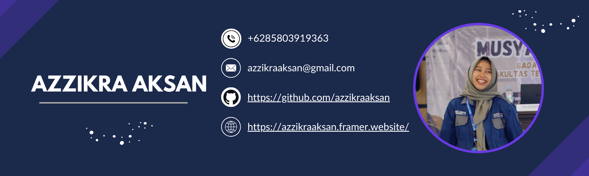

## Heyho👋~ I'm zikra, a student who learns about code><

<!--
**azzikraaksan/azzikraaksan** is a ✨ _special_ ✨ repository because its `README.md` (this file) appears on your GitHub profile.

Here are some ideas to get you started:

- 🔭 I’m currently working on ...
- 🌱 I’m currently learning ...
- 👯 I’m looking to collaborate on ...
- 🤔 I’m looking for help with ...
- 💬 Ask me about ...
- 📫 How to reach me: ...
- 😄 Pronouns: ...
- ⚡ Fun fact: ...
-->
I'm a student majoring in Information Systems with a strong interest in **Front-End Development** and **Data Science**. I enjoy turning ideas into interactive web interfaces and exploring data to find meaningful insights.

---

### 🚀 What I'm Up To
- 🌱 Currently learning and building with **React**, **Next.js**, and **Tailwind CSS**
- 🔍 Exploring **Machine Learning** using Python (Scikit-learn, Pandas, NumPy)
- 🔧 Building projects with **Flask**, **Laravel (basic)**, and databases like **MySQL** & **MongoDB**
- ✨ Improving my UI/UX skills with Figma & real-world projects